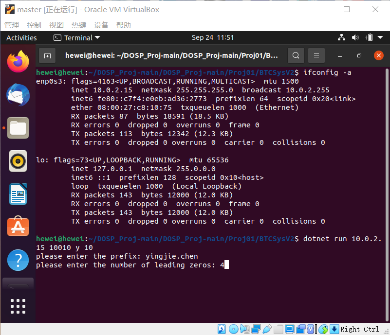

# DOSP_Proj01

## Group Members

1. UFID: 83981600, Email: yingjie.chen@ufl.edu
2. UFID: 84714011, Email: wei.he@ufl.edu

## How to Run

### Windows 10

1. Environment Setup: 

   ​	.NET SDKs

   ​	.NET runtimes

2. Decompressing the .RAR file: BTCSysV2.rar 

3. Opening Command Prompt and Going to the folder obtained from the second step

4. Typing in "dotnet run 192.168.230.1 10010 y 10" to run the main application

   - "192.168.230.1" should be replaced with your computer IPv4 Address
   - "10010" should be replaced with one of unused ports on your computer
   - "y" meaning that this will be going to run as main application
   - "10" meaning that there are 10 worker actors running to calculate
   
5. On the base of the fourth step, it will need you to type in the prefix and the number of leading zero to run

   

   

6. Copying the decompressed folder mentioned above to another computer that can connect to the computer above (main application run on) 

   - the next steps (about sub application that will join in main application to calculate) will run in Linux
     - on Linux, .NET SDKs and .NET runtimes should be installed first

7. Going to the folder on Linux and Typing in "dotnet run 192.168.17.131 10011 n 10"

   - "192.168.17.131" should be replaced according to your situation
   - "10010" should be replaced with an unused port on your operating system
   - "n" meaning that what is going to run is sub application
   - "10" meaning that there are 10 worker actors in sub application

8. On the base of the seventh step, you will need to type in the IPv4 Address and the specific port  both of the main application 

   

   - Above image is from main application, when a sub application joins in main application, we can see related information displayed

   

   - Above image is from sub application, the information represents it connects to the main application

### Result Description

- All the important information will be printed on the main application screen.
- Main information printing format like "[%s] with [%s] leading zeros [%s]"
  - First placeholders means one of results
  - second means the number of leading zeros
  - third means sha256 string of first placeholders string
- The screen of main application will display strings with specific number of leading zeros when start running and display sha256 string with leading zeros but just one time with different number of leading zeros.
  - For example, when we start running and input 5 leading zeros, it will display all result with 5 leading zeros, but for 1, 2, 3 ,4, 6, 7, and so on leading zeros, just display one of their results.

## Architecture

### The structure of the source code

- "Msgs.fs" defines different kinds of messages
- "Actors.fs" defines different kinds of actors
- "Programs.fs" is the running entry of the application

### Actors Function

- Worker: Computing and Submitting the result to StateManager
  - Each started worker will asks StateManager for a length of suffix string and then calculates all possible string in this length. Without stop Main Application running, suffix length will increase continuously and worker will calculate one length, so the size of work unit is one and the suffix length has no limit.
  - After calculating all possible string in the specific length, each work will ask StateManager again for the next suffix length
- StateManager: 
  - Designating suffix length that will increase with the increasing number of workers asking for to worker or connector that will send the length to outer application
  - After receiving a result with specific length of leading zeros, it will check if there was a same result, if not, send message to printer for printing it. But for other results with non-specific length of zeros, it print one of them, for example, if there are more than one result with three leading zeros, just sending message about one result to printer for printing
  - In Sub application, if one of worker sends message about finding one result, StateManager will send it to connector that will then send to Main Application in the Sub Application.
  - In Sub application, when receiving asking for suffix length from workers, StateManager will send message to StateManager of Main Application to ask through connector.
- Connector:
  - Communication Between main application and sub application
- Printer
  - Printing Information to console in Main Application

### Two Modes 

- Main Application
- Sub Application

### Architecture Diagrams

- Main application and Sub application

  

- Communication in Main Application

  

- Communication in Sub Application

  

- Main Application and several Sub Applications

  

## Experiment

#### Result

The program is running on two virtual machines of Linux Ubuntu systems to get the cpu time, since linux supports better in multi-core and multi-thread operations. Each machine sets two cores at the beginning to do the paralleling computing.
1. Main Application:
   -IP: 10.0.2.15
   -Port: 10010
   -Running the command "dotnet run 10.0.2.15 10010 y 10"
   -Input the prefix "yingjie.chen"
   -Input the leading 0
   
   

2. Sub Application:
   -IP: 10.0.2.4
   -Port: 10010
   -Running the command "dotnet run 10.0.2.4 10010 n 10"
   -Input the Main application IP: 10.0.2.15
   -Input the Main application Port: 10010
   
   

Outcome of leading 0 = 4

   

   

   

   

The list will extend unless pressing the "Enter" button to stop.

#### CPU Usage

The real time takes the system time of Linux. The CPU time can be shown synchronizingly using Linux conmmands which are listed below. CPU time and CPU usage is the summary time and usage of the two cores allocated to each machine.
- After the Main Application begins calculating, input "ps -aux" in a new terminal window to acquire PID of the process
- Input "top -t #PID" to get the dynamic corresponding CPU usage situation

1. Main Application
-Start: REAL TIME is 10:22
-After a time interval:
   - Real time: 10:29
   - CPU time: 11:27.94
   - CPU time > Real time (10:29 - 10:22), proving that this actor model is CPU bound.
   - Ratio of CPU time / Real time = 11.5 / 7 = 1.6429 (as there is only two cores)
   - CPU Usage: 172.3%. Average: 170%

Start Picture:

   

Later Picture:

   

2. Sub Application
-Start: REAL TIME is 10:23
-After a time interval:
   - Real time: 10:27
   - CPU time: 6:36.53
   - CPU time > Real time (10:27 - 10:22), proving that this actor model is CPU bound.
   - Ratio of CPU time / Real time = 6.6 / 5 = 1.32 (as there is only two cores)
   - CPU Usage: 171.3%. Average: 169%

Start Picture:

   

Later Picture:

   

#### Coins with most 0s

Coins with nine 0s is the most out program can find. When 0s = 10, the program need a long time to compute the result and that time has proved to be longer than 1 hour.

#### Scalability

After starting one Main Application, we can start a number of Sub Application in the same machine or other machines to join in computation for finding the results with specific length of leading zeros and other results with different length of leading zeros.

